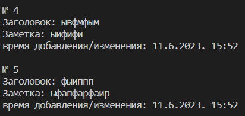

# Задание

Реализовать консольное приложение заметки, с сохранением, чтением,
добавлением, редактированием и удалением заметок. Заметка должна
содержать идентификатор, заголовок, тело заметки и дату/время создания или
последнего изменения заметки. Сохранение заметок необходимо сделать в
формате json или csv формат (разделение полей рекомендуется делать через
точку с запятой). Реализацию пользовательского интерфейса студент может
делать как ему удобнее, можно делать как параметры запуска программы
(команда, данные), можно делать как запрос команды с консоли и
последующим вводом данных, как-то ещё, на усмотрение студента

## Описание консольного приложения заметки

## Функционал программы

Это приложение при первом запуске информирует пользователя о том, что в нём ещё нет заметок и предлагает сразу же внести одну. После добавления первой заметки программа предоставит весь функционал программы. А именно:

- посмотреть список всех заметок
- добавить заметку
- удалить заметку
- внести изменения в заметку
- загрузить данные из бд в приложение
- загрузить данные в бд из приложения
- найти заметку по названию или дате
- закончить работу
- help

### Просмотр всех заметок

За эту функцию отвечает метод **show_all_notes()**. Он построчно выводит заметку на экран.

Пример:

### Добавление заметки

За эту функцию отвечает метод **add_note()**. Внутри этого метода используются вспомогательные методы ***creat_key()***, который создаёт уникальный ключ(идентификатор) заметки и ***giv_time***, который возвращает дату и время создания заметки

### Удаление заметки

За эту функцию отвечает метод **remove_note()**. При выборе этой функуии пользователю предоставляетмся весь список заметок и предлагается ввести номер заметки, которую нужно удалить.

### Внесение изменения в заметку

За эту функцию отвечает метод **fixing_note()**. При выборе этой функуии пользователю предоставляетмся весь список заметок и предлагается ввести номер заметки, которую нужно изменить. Если есть заметка с таким номером, то программа покажет эту заметку и предложит изменить название или же текст самой заметки.

### Загрузка данных из бд в приложение

За эту функцию отвечает метод **load()**.

### Загрузка данных в бд из приложения

За эту функцию отвечает метод **save()**.

### Закончить работу

За эту функцию отвечает метод **ending()**.

### help

За эту функцию отвечает метод **help()**.
